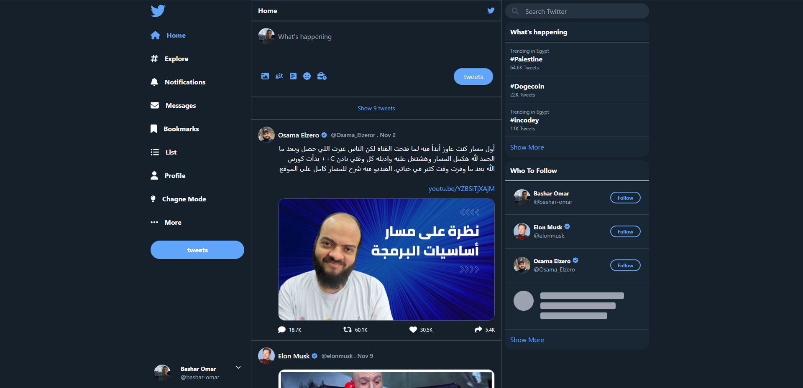

<h1 align="center">Website Project | Twitter Clone</h1>

  <h3>
    <a href="https://bashar-omar.github.io/Twitter-Clone/">
      Demo
    </a>
  </h3>

## Table of Contents

- [Overview](#overview)
  - [Built With](#built-with)
- [Contact](#contact)

## Overview

Project Website Training Tailwind Framework

Twitter Clone From Scratch Using Only Tailwind

And Using the Change Mode Option

## Built With

- <h4>HTML</h4>
- <h4>Tcailwind CSS Framework</h4>

## Contact

- Website [Incodey](https://incodey.com/)
- GitHub [Bashar-Omar](https://github.com/Bashar-Omar)
- linkedin [bashar-omar](https://www.linkedin.com/in/bashar-omar/)
